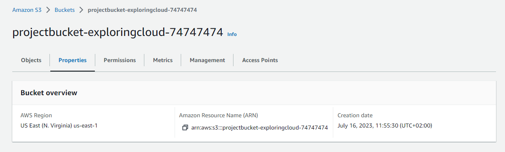
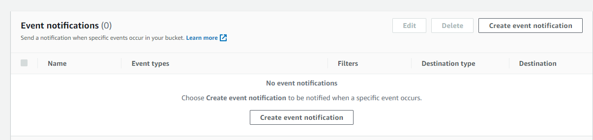
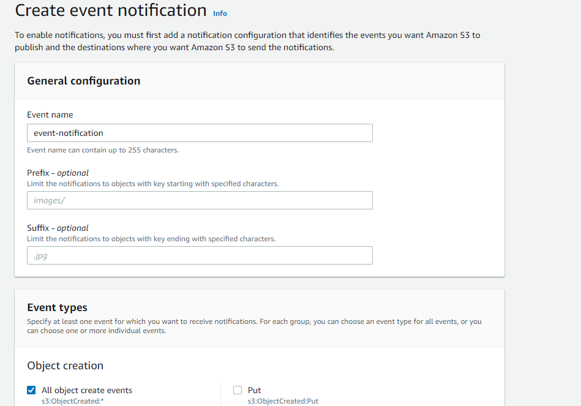
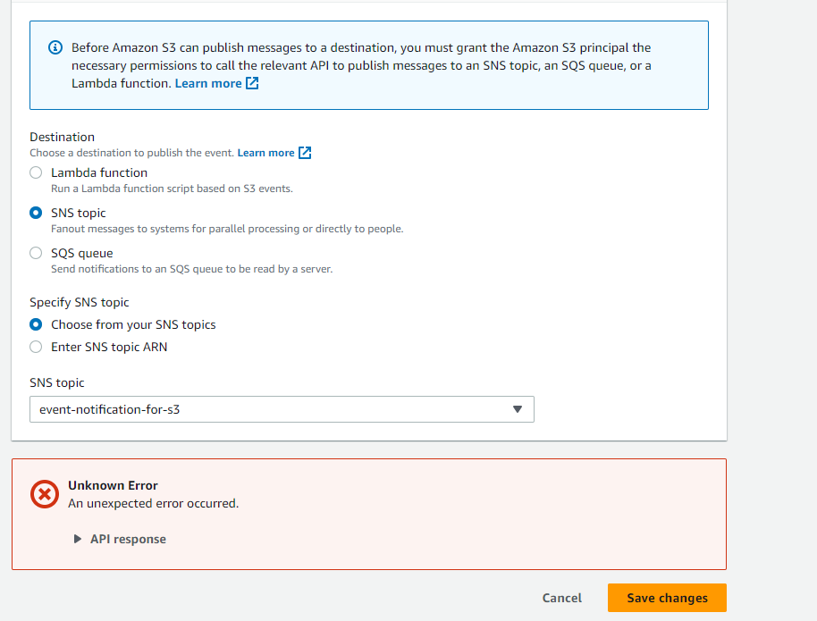

Project Description: Creating an S3 event to receive a email notification for a object upload event with SNS 

Services used: Amazon S3, Amazon SNS

Section 1: Creating a S3 Bucket

1. Navigate to the Amazon S3 service by typing "S3" in the AWS service search bar and selecting the Amazon S3 option that appears.
2. In the Amazon S3 dashboard, click the "Create bucket" button. A dialog box will appear.
3. Provide Bucket Name: Enter a unique and meaningful name for your bucket. Bucket names must be globally unique across all AWS accounts
4. Keep other settings as default, scroll to the bottom of the page and select create bucket.

Section 2: Creating a SNS topic and Subscription

1. In the AWS Management Console search bar and select the "Simple Notification Service" option from the results.
2. In the SNS dashboard, click on the "Create topic" button to start creating a new SNS topic.
3. Select Standard topic, assign a name to your topic then scroll to the bottom of your page and click create topic

Your configuration will look something like this:

4. Now we have to create a subscription for this SNS topic so that we can receive notifications published to the topic
5. In the above screenshot you will see a create "subscription button" select that
6. In the new window select the Topic ARN (ARN of your SNS topic), protocol and Endpoint as below and hit the "Create Subscription" button at the bottom of the Page 

7. The last thing now left to do is confirming the subscription, check your email from Amazon and confirm subscription 

Scetion 3: Creating a S3 event notification
1. Navigate back to your S3 bucket and under properties scroll down and locate the Event notifications section 

2. Now select Create event name and event types you wish to receive notifications for 
3. All that is left to do is select the destination where you want to send these events, select SNS topic we created earlier 

4. But we are getting a error while saving changes that is because we didn't allow s3 to send event notifications to the SNS topic 
5. Lets modify the policy now, Navigate back to the SNS topic, choose edit and under "access policy" modify the permissions as below 
(MAKE SURE TO REPLACE Resource with arn of SNS topic, aws:SourceArn with arn of S3 bucket and aws:SourceAccount with your account id ) 

   {
    "Version": "2012-10-17",
    "Id": "example-ID",
    "Statement": [
        {
            "Sid": "Example SNS topic policy",
            "Effect": "Allow",
            "Principal": {
                "Service": "s3.amazonaws.com"
            },
            "Action": [
                "SNS:Publish"
            ],
            "Resource": "SNS-topic-ARN",
            "Condition": {
                "ArnLike": {
                    "aws:SourceArn": "arn:aws:s3:*:*:bucket-name"
                },
                "StringEquals": {
                    "aws:SourceAccount": "bucket-owner-account-id"
                }
            }
        }
    ]
}                  

  
7. Now navigate back to s3 and try to save the changes, Your configuration is now setup
8. Final step is to upload an object to an s3 bucket and test if you receive an email noticication as below:

   

   

